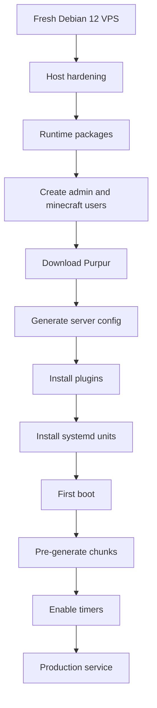

# Phase 0 Architecture

## Objective

Build a hardened, reproducible, maintainable Minecraft host for the official
bits&bytes server on Debian 12 with support for:

- Java Edition
- Bedrock Edition
- Premium Java accounts
- Cracked Java accounts
- Cross-version support
- Moderate plugins
- Automatic backups and recovery
- Production-style service management

## Assumptions

- Single VPS, not a clustered deployment.
- Debian 12 Bookworm on a clean host.
- 4 vCPU, 8 GB RAM, 30 GB SSD.
- Network exposure is public eventually.
- The server is operated by trusted staff with SSH key access.
- The current operating system account `azureuser` remains the initial access path.
- The target workload is 10-20 concurrent players, medium redstone, AFK farms, and moderate plugin load.

## High-level design

### Base layer

- Harden Debian 12
- Keep only the packages required for the host role
- Install unattended security upgrades
- Configure UFW and Fail2Ban
- Run Minecraft as a dedicated `minecraft` service account

### Runtime layer

- Java 21 LTS from Debian packages
- Utility tools for compression, networking, backups, and diagnostics
- systemd-managed service lifecycle

### Game layer

- Purpur as the server runtime
- Paper-compatible plugin ecosystem
- Bedrock via Geyser and Floodgate
- Authentication via nLogin for cracked Java accounts
- Permissions via LuckPerms
- Gameplay/quality plugins only where they provide a clear operational benefit

### Operations layer

- Structured logs through journald
- Compressed local backups with retention
- Health-check scripts for host and JVM state
- Recovery and update procedures that are script-driven and documented

## Dependency graph

## Execution order

1. Harden the host before exposing the game service.
2. Install runtime packages and service accounts.
3. Download Purpur and lay out the server directory tree.
4. Install plugins.
5. Configure systemd.
6. Perform an initial controlled boot.
7. Pre-generate the playable area.
8. Enable backup and health timers.
9. Validate the service path and document the result.

## Performance strategy

- Keep the heap at 4G-5G so the OS, filesystem cache, and plugins still have breathing room.
- Prefer G1GC with a small, modern flag set rather than outdated flag packs.
- Set `view-distance=8` and `simulation-distance=6` so the host stays within its 4 vCPU budget.
- Set `allow-flight=true` to avoid breaking AFK farms and legitimate movement mechanics.
- Pre-generate a 3000-block overworld radius with Chunky so ordinary gameplay does not pay the chunk-generation cost.
- Keep `pause-when-empty-seconds=-1` so pre-generation and maintenance jobs do not pause on an empty server.
- Keep logs and backups compressed and rotated to stay inside the 30 GB SSD budget.

## Security strategy

- SSH key-only access
- No root SSH login
- No Minecraft root execution
- Restrictive firewall
- Fail2Ban for SSH
- Dedicated service account with minimal filesystem scope
- Sensitive secrets stored with root-only file permissions
- Offline-mode risks documented because cracked-account support is required

## Operational philosophy

- Prefer simple, debuggable, reversible changes.
- Use upstream-supported mechanisms over folklore.
- Make each shell script fail loudly and log clearly.
- Keep versioned releases so rollback is a pointer swap, not a rebuild.

## Risk analysis

### Security risks

- Offline-mode authentication expands spoofing risk.
- Bedrock bridging requires careful separation of trust boundaries.
- Plugin supply-chain trust must be explicit.

### Reliability risks

- Backup windows can interrupt the game if live snapshotting is not used.
- Plugin updates can regress gameplay or startup.
- World pregeneration can consume disk and CPU temporarily.

### Capacity risks

- 30 GB SSD is tight once worlds, backups, and logs accumulate.
- 8 GB RAM constrains heap and plugin count.
- Excessive entity counts or farms can outgrow the stated target.

## Rollback strategy

- Keep each Purpur download in a versioned release directory.
- Keep backups compressed and timestamped.
- Keep config edits incremental and documented.
- If an update fails, stop the service, restore the prior release pointer, and restart from the last known good backup.
- If a plugin update breaks startup, remove only the last changed plugin jar and restore the previous backup copy.

## Future extension points

- Off-site backup sync
- Monitoring export to an external dashboard
- Proxy-based topology if the service later splits into frontend/backend roles
- Snapshot-based live backups if block-device snapshots are introduced later
